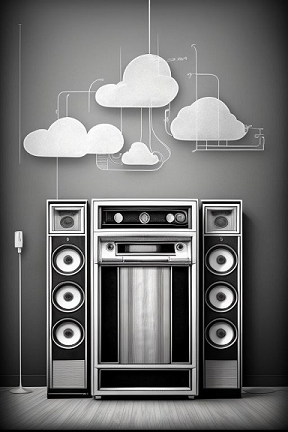

# Euther-PI

E aí?! Se você chegou aqui e não sabe o que é `Eutherpe`, te sugiro dar uma conferida
[aqui](https://github.com/rafael-santiago/eutherpe) primeiro e depois voltar... :wink:

Agora se você já está por dentro. Que tal embarcar um éter musical num `Raspberry Pi`?
Dessa forma, você terá dentro de uma caixinha austera, `low-profile` e elegante um `player`
musical que realmente vai te afastar um pouco mais daquela dinâmica chata de ouvir música
em frente a um `desktop` ou celular e ser bombardeada(o) com quilos e quilos de sugestões e
propagandas idiotas. Esse monte de ruído esvazia o ritual de ouvir suas músicas favoritas.
Aqui menos é mais!

Outro lema é: `Faça você mesmo`!

A intenção desse repositório é apenas reunir uma série de instruções para que você seja
capaz de criar o seu `Euther-PI` (colocar `Eutherpe` para rodar dentro de um `Raspberry Pi`)
por sua própria conta sem precisar pagar ninguém para fazer isso. Você não precisa ser um
especialista em computação para fazer isso. Eu bolei esse projeto pensando em amantes de
música que usam computador mas que não são técnicos e que mesmo assim querem ter `Eutherpe`
embarcada numa placa para tê-la o máximo disponível na rede local de suas casas e longe de
`clouds` de terceiros. Você sabe, nuvens sinistras carregadas de propaganda chata que só chove
no molhado. :cloud: :umbrella: :zzz:

Sem contar que usar uma coisa que você mesmo montou é muito mais legal! E aí? Topa?! :shipit:

Mãos a obra, você pode começar por [aqui](doc/HOW-TO-EMBED-AN-ETHER-PT.md).

-- Rafael

>"- Oh! English, please?"
>
>"- Okay..."

Hi there! If you arrived here but do not have any idea of what `Eutherpe` is, I suggest you
take a look at [here](https://github.com/rafael-santiago/eutherpe) and getting back later... :wink:

Now if you have already known `Eutherpe`, what about embed a musical ether inside a `Raspberry Pi`?
Doing it you will have inside an austere, `low-profile` and elegant little box a music player.
This music player will really get you far away from that boring dynamics of listening to music
in front of a `desktop` or `smartphone` by being flooded with tons of suggestions and idiotic ads.
Those excesses of noise empty the ritual of listening to your beloved tunes. Here less is more!

Another motto: `Do it yourself`!

The intentions of this repository is only gather a serie of instructions to you be capable
of creating your `Euther-PI` (putting `Eutherpe` to run inside a `Raspberry Pi`) on your own
without needing to pay somebody else to do it for you. I came up with this project thinking on
music lovers that use the computer but that are not technicians on that, but anyway are wanting
to have `Eutherpe` embedded in a board. In this way, `Eutherpe` will be available in their
home network and far from third party `clouds`. You know, sinister heavy clouds, bloated with
a lot of boring ads. :cloud: :umbrella: :zzz:

Using a thing made by your own it is much cooler! What about? Are you up for it? :shipit:

Let's get to work, you can start from [here](doc/HOW-TO-EMBED-AN-ETHER-EN.md).

-- Rafael

