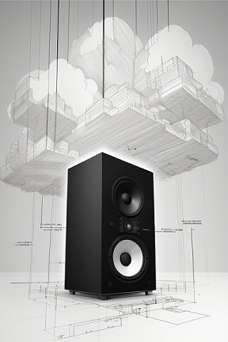
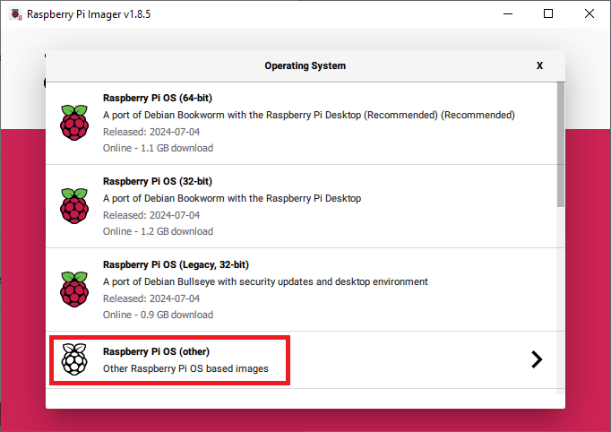
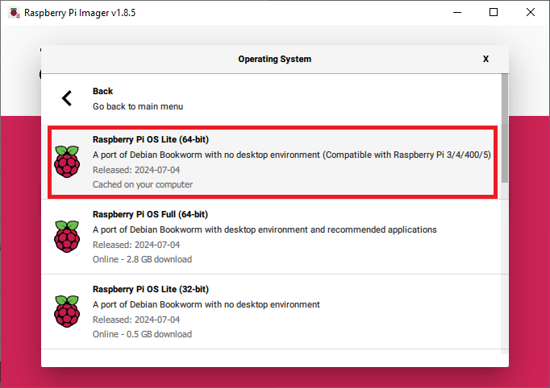
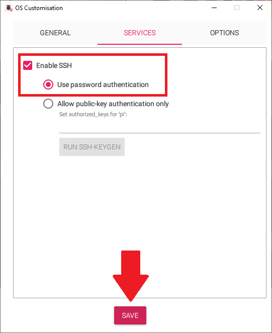
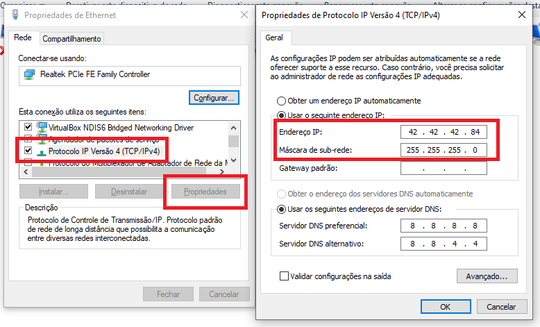

# How to embed an ether

**Abstract**: This document gathers all steps and explanations about how to embed `Eutherpe`
in a `Raspberry Pi`. If you are wanting to give it a try in other boards, you can get some
directions by using this guide, too. Nevertheless, this text is intended to folks (tech ones
or not) that bought a `Raspberry Pi` intending to use it to play music through `Eutherpe` by
getting rid off the `Desktop` and also the excuse of using the `(un)smartphone` because "in the
`Desktop` is worse".

## Topics

- [Stuff that you will need](#stuff-that-you-will-need)
- [The Raspberry Pi Imager](#the-raspberry-pi-imager)
- [All aboard](#all-aboard)
    - [What we gonna do](#what-we-gonna-do)
    - [Installing the basic no-frills Raspbian](#installing-the-basic-no-frills-raspbian)
    - [These boots are made for walking](#these-boots-are-made-for-walking)
- [Congrats you have just embedded an ether](#congrats-you-have-just-embedded-an-ether)
- [FAQ and troubleshooting](#faq-and-troubleshooting)
    - [Can I share my Raspberry between Eutherpe and other software?](#can-i-share-my-raspberry-between-eutherpe-and-other-software)
    - [How can I update my Eutherpe copy from inside my Raspberry?](#how-can-i-update-my-Eutherpe-copy-from-inside-my-raspberry)
    - [I forgot the Wi-Fi access to Eutherpe](#i-forgot-the-wi-fi-access-to-eutherpe)
    - [I have configured a password access but I forgot it](#i-have-configured-a-password-access-but-i-forgot-it)
    - [I don't use only one Wi-Fi profile, I travel a lot and I am always changing my Wi-Fi access configurations. Does exist a way of using Eutherpe under this scenario?](#i-dont-use-only-one-wi-fi-profile-i-travel-a-lot-and-i-am-always-changing-my-wi-fi-access-configurations-does-exist-a-way-of-using-eutherpe-under-this-scenario)

## Stuff that you will need

Things that you will need to embed `Eutherpe`:

- A `desktop` or `laptop` running `Linux`, `Windows` or `Darwin` (a.k.a `MacOS`).
- Have `SSH` installed on it.
- A `Raspberry Pi`. It can be a `Raspberry Pi 3B+`, a `Raspberry 4B` or even a `Raspberry 5B`.
  Depending on your budget and hardware availability. I suggest you dedicate it to play music, so
  it should exclusively run our `low-profile` and ethereal muse. :sunglasses: As a matter of
  information I use `Eutherpe` in a `4B`.
- A power supply to your board.
- Heat sinks, even it being an `ARM` is always good put on heat sinks to promote a nice lifespan
  to your board.
- A case to protect your board.
- A `microSD` card (at least `16GB`).
- A `USB pen drive`.

If you have picked the `Raspberry 5B` I believe that it is able to handle more things embedded than
just `Eutherpe`, anyway you should pay attention to some aspects, more on that later. The `3B+`
nowadays (`2024`) is well-known as the "slow", I have never embedded `Eutherpe` on it, if you did so,
tell me about of your experience using `Eutherpe` on it, thank you! :wink:

[`Back`](#topics)

## The Raspberry Pi Imager

You need to install `Raspberry Pi Imager` in the system of your `desktop/laptop`. Pick your version
[here](https://www.raspberrypi.com/software/). The installation is pretty straightforward, I believe
you will do it within minutes!

[`Back`](#topics)

## All aboard

Finally we will start! The idea is giving you the tips to you get it asap to go have some fun
listening to your music.

[`Back`](#topics)

### What we gonna do

> [!IMPORTANT]
> Before powering on your Raspberry Pi put the heat sinks. At YouTube you have a bunch of
> [videos](https://www.youtube.com/results?search_query=put+heat+sinks+raspberry+pi) that
> could instruct you how get it done. Just go ahead after doing it.

These are the steps that we will execute (btw with practice you will be able to do it by yourself):

- From `Raspberry Pi Imager` install the basic operating system in the `microSD`.
- Insert the `microSD` in your `Raspberry Pi` and powering it on.
- Using `ssh`, access your `Raspberry Pi` (if you are not a tech person, I will teach you all
  the incantations, I will not let go of your hand for a minute, believe on it :wink:).
- Once logged in your `Raspberry Pi`, download `Eutherpe`'s source code.
- Build `Eutherpe` and also install everything need to work on your board.
- The `Raspberry` will reboot, you will plug a `USB stick` having your songs and finally you will
  access the `Eutherpe's` `Web miniplayer`.

This is the general idea! Let you alone ASAP to listen to your tunes. If it really happen, my
job will be complete! :sunglasses:

[`Back`](#topics)

### Installing the basic no-frills Raspbian

Insert the `microSD` in the existent slot of your `desktop` or `laptop`.

Open the `Raspberry Pi Imager`. If you did not download it yet, [download it](https://www.raspberrypi.com/software) and install it to continue.

Just after opening it you will see a screen similar to the one depicted in **Figure 1**. On this
screen you will see four buttons: `CHOOSE DEVICE`, `CHOOSE OS`, `CHOOSE STORAGE` and `NEXT`.


**Figure 1**: The `Raspberry Pi Imager` main screen.

The `NEXT` button is only enabled after you handle with the three first. So we *need to follow
the order....*

When you click on `CHOOSE DEVICE` it will open a screen listing the boards for your picking.
You must choose the exact version of your `Raspberry Pi` board. In my case I picked `Raspberry
Pi 4`, change according your state of things. Take a look at **Figure 2** to guide yourself.


**Figure 2**: The screen where you choose your board's version.

After you will click on `CHOOSE OS` and a screen similar to **Figure 3** will be shown. At this
screen you will choose which operating system will run inside your `Raspberry Pi`. In case of
this `how-to` it is assumed that the entire board will be dedicated to play music and transmit
it over `Bluetooth` (if you want to). Due to it, pick `Raspberry Pi OS (other)`. Finally it will
be shown a screen where you will select the specific kind of operating system, we will choose
a text based environment, no frills. We want to save system resources to play music without
much "noisy" :wink:. Take a look at the **Figure 4**!



**Figura 3**: In this screen you must choose `Raspberry Pi OS (other)`.



**Figure 4**: Choose `Raspberry Pi OS Lite (64-bit)`, no frills!

Once chosen the board version and the operating system, we need to indicate where this built
system will be recorded. In order to do it click on `CHOOSE STORAGE`. A screen similar to
**Figure 5** will be shown. Click on the listed device related to your already inserted `microSD`.


**Figure 5**: In this screen you will get your `microSD` listed, just click on it.

Finally, the `NEXT` button will become enabled, take a look at **Figure 6**. At this point,
just click on it!


**Figure 6**: With all tuned up it is only about record the operating system in the `microSD`.

When `NEXT` is clicked, it shows a question screen wanting to know if you want to customize
some convenient configurations. It is a good thing to do because it makes easier the access
to your `Raspberry Pi` over you network. So click on `EDIT SETTINGS`, take a look at **Figure 7**.


**Figure 7**: Click on `EDIT SETTINGS` in order to open the customization screen.

In the customization screen you need to check the four check boxes marked up in **Figure 8**.
Filling up `hostname` with a name that you can "call" your `Raspberry Pi` in your network.
Also to define a `username` and `password` (sometimes a thing different from `pi` does not work,
if you let `pi`, the password it will be `raspberry`). In the field `SSID` and `Password` you
need to fill them up with the name of your `Wi-Fi` and its password, respectivelly. After doing
it click on `SERVICES` sheet. It will show a screen similar to the **Figure 9**.


**Figure 8**: The screen where you customize your `Raspberry Pi`.



**Figure 9**: Finishing the customizations up.

In the `SERVICES` sheet you need to check the `Enable SSH` option and also choose `Use password
authentication` and then click on `SAVE`.

Just after it will pop-up a warning similar to **Figure 10**. You need to confirm that you agree
about erasing all previous content of your `microSD` before continuing, click on `YES`.


**Figure 10**: Click on `YES` to start on copy the operating system image to your `microSD`.

First it will be shown a progress bar indicating that a writing process is in course, look
**Figure 11**.


**Figure 11** Writing the `OS` to your `microSD`.

After it will be shown a progress bar indicating that a verification process is in course,
look **Figure 12**.


**Figure 12**: Waiting on verification.

If all were done correctly, you will get a information saying that the operating system was
successfully written to your `microSD` and that you already can remove it from the slot, take
a look at **Figure 13**.


**Figure 13**: Your `microSD` is ready to be inserted in your board!

Done! Now you have a system to give life to your `Raspberry Pi`. Now it is only about
insert the `microSD` in the place on your board dedicated to it (the `microSD` contacts, those
"little teeth" must be turned to above. Power on your `Raspberry Pi` by plugging on the power
supply cord and you done every single thing. Congrats! You did well and did not even hurt!

[`Back`](#topics)

### These boots are made for walking

Now it is only about doing the `Eutherpe bootstrapping` (I am taking into consideration that
you read about it [here](https://github.com/rafael-santiago/eutherpe/blob/main/doc/MANUAL-EN.md)).

In order to do it you need to access your `Raspberry Pi` via `SSH`. Assuming your computer is
in the same local network of your `Raspberry Pi` (a.k.a "your Wi-Fi"), open a `command prompt`
if your are in `Windows` or a `Terminal` if you are in `Linux` or still a `Terminal app` if
you are in `MacOS`.

Once it done you need to type the following:

```console
_ ssh <username>@<hostname>
```

In doubt of what `hostname` your `Raspberry Pi` is using, go back to the **Figure 8** to remember
where you can get this information, well as `username`, too.

In my case, following the example, they would be:

```console
ssh pi@xablau.local
```
If a message asking you to confirm yes/no be shown, type "yes" and hit `ENTER`. Following up
the password will be asked, too. Type it, too.

Once logged in, you will type the following:

```console
_ sudo su
```

Once it done, you will become superuser (a.k.a `root`). If you really have superuser powers
you will notice a dash symbol in the prompt:

```console
pi@(...)# _
```

Now we will install the `git` application and using it we will download `Eutherpe`'s source code:

```console
# apt install git -y
```

After finishing up the `git` installation download the `Eutherpe` source code as follows:

```console
# git clone https://github.com/rafael-santiago/eutherpe -b v1
```

After you need to jump to source directory:

```console
# cd eutherpe
```

Being inside the `eutherpe` directory, run the `bootstrap`:

```console
# ./bootstrap.sh
```

When running the `bootstrap.sh` script will ask you if you really want to `boostrap` your system.
Something like:

>Do you want to bootstrap your system? [y/n]

At this point type "y".

Just after the `bootstrap` script will ask you if you want to change the `default port` used
to access the `Eutherpe` player via `web`:

>Do you want to change Eutherpe's default listen port (8080)? [y/n]

The `default port` is `8080`. I would let it, but if you want to change, confirm your intention
by typing "y" and after inputing the port of your choice and hitting `ENTER` to confirm.

The `bootstrap` script at this point it will detect that you are embedding `Eutherpe` inside
a `Raspberry Pi` and it will ask you if you want to configure a rescue `ethernet` interface.
This action will put a static address in the ethernet board of your `Raspberry Pi` (`42.42.42.1`)
and a spare one `42.42.42.2`. If due to some issue you become unable to access your device over
your `Wi-Fi` you will still be able to access it over a point-to-point (`P2P`) network via the
`42.42.42.1` ip or `42.42.42.2`. It is a good convenience of having set up.

Why provide two rescue IPs, each one in a different NIC? Well, the idea behind this concept
is never let you "down". From personal experience, my `Raspberry Pi` came from factory with
cold solder in its on-board `Ethernet` interface. With it I was pushed to buy a external
`Etnetnet Gigabit` adapter. The necessity is the mother of invention. The initial idea
was to provide only one rescue IP, but with this cold solder issue I finished up with a more
resilient rescue system. I configure the stuff in a way that when you plug in the cable in the
chosen interface (on-board/external) the operating system is able to switch the route to this
active interface. However, you will be able to ping both IPs, not mattering in which the cable
is plugged in.

Yes, `The Hitchhiker's  Guide to the Galaxy` was my inspiration to those `IP` addresses.

The `bootstrap` will ask you something like:

>Do you want to set up a rescue ethernet interface? [y/n]

If you want to, you need to type "y".

When detecting that the `bootstrap` is ocurring from a `Raspberry Pi` it will also ask you if a
`Wi-Fi` preconfiguration should be done:

>Do you want to set up the Wi-Fi? [y/n]

Here you will choose "n", because the `Wi-Fi` it was already configured via `Raspberry Pi Imager`.
:sunglasses: Remember that you are connected to your board over your `Wi-Fi` already.

After that confirmations, it is only about watching on. Everything will be tuned up and at the
end your `Raspberry Pi` it will be rebooted. Once reboot done your no-frills muse will be ready
and waiting for you!

Plug in a `USB pen-drive` in your board and access `http://eutherpe.local:8080/eutherpe` (if
you have changed the `default port` replace `8080` to your port of choice). If you do not
know how to use the `Eutherpe`'s `web miniplayer` you should read the [`manual`](https://github.com/rafael-santiago/blob/main/doc/MANUAL-EN.md).
I believ that the player is pretty intuitive and straightforward, by poking it up, you will also figure out.

[`Back`](#topics)

## Congrats you have just embedded an ether

So you have just embedded a "musical ether" in a board and I hope that this ether be able to
float you far from screens, ads and all other excesses and at the same time that this ether
takes you near to your favorite songs and what of good them evoke to you.

At first glance it can sound weird: stay more time listening to than poke a screen or
waiting for the next ad or nosy suggestion that spoil your musical `flow`. Nevertheless, insist on
it that soon you will be detox from all those bad things by relearning a simply act that
nowadays is so poluted and ridiculous.

Maybe also could be hard to notice that your are not grazing on ads with small intervals of
music to keep you on grazing on and on. But it is possible and you do not have to pay me
nothing for it. Pay the artists that compose, record your favorite albums and go attend to them
concerts. Take the change of enjoy in a real `3D` world beyond screens, surrounded by real people
than just avatars! :wink:

I do not see you as a cow, I do not want to you grazing on ads to me to give me some cents. I
prefer to earn my living another way. Coding to me it is like writing essays. I express myself
about my likes and beliefs even being it in a non context free form, but even so to me it is
a language that exceeds simply the mere programming and techicalty, my ideas and ideals hatch,
and I value that. I love details, and in details are my protests, sarcasm (I am not perfect),
criticism and opinions. When using this `software` you **are not** singing a faustian pact.
No small letters... I just want to prove to you that you have the right of listening to music
with no ads, without needing to pay ransom to your ears!

So, maybe you are thinking:

>"Did you write `Eutherpe` and `Euther-PI` as a kind of computational `QED` about how
> listening to music nowadays is shitty, due to the intense search for profit but that even so it
> is possible to set us free from all this bad things and reconecting ourselves with the pure
> habit of listening to our music by using a straightforward homemade device, Rafael?


Do not reduce your beloved tunes to backdrop for ads! Have love for what moves you!

Notice still: the `software` industry has the pretty bad habit of calling their customers "users"...
Due to it, beware who you messing with.

Finally, after provoking myself with those thoughts, within some months I went from it:

<td border></td>

...to my beloved monolith! :sunglasses::

<table>
    <tr>
        <td></td>
        <td></td>
        <td></td>
    </td>
</table>

The path is paved, I hope you be able to do this transition faster than me by getting a
similar monolith in your home, too. If one of these days you woke up want to listening to
*YOUR music* with no interruptions, power on your `Euther-PI` and give a chance to this muse,
you may fall in love with her and never let go of its charms! :wink:

-- Rafael

[`Back`](#topics)

## FAQ and troubleshooting

### Can I share my Raspberry between Eutherpe and other software?

It depends on your board and also on what you want to run on together. Realize that if your really
want to a device to play music, it is interesting to mind about good listening experience. When
you have a bunch of other application concurring with `Eutherpe` you can degradate the whole
system performance and have choppy sounds and it is terrible when listening to music by digital
means.

Another point it is that to mind about a good listening experience I invest on much time
struggling with `Pulseaudio` and `Pipewire/WirePlumber` until giving up all them and embrance
`ALSA/bluez-ALSA`. Due to it, if you want to put `Eutherpe` sharing your `Raspberry Pi` with other
applications make sure of dedicate `bluetooth` and `sound` just for `Eutherpe`. If you want more
details about my struggling with `bluetooth` issues on `Linux` you can read more [here](https://github.com/rafael-santiago/eutherpe/blob/main/doc/THE-LINUX-BLUETOOTH-BLUES-PT.md).
you need to understand portuguese, I did not translate it.

[`Back`](#topics)

### How can I update my Eutherpe copy from inside my Raspberry?

Once you have `Eutherpe` functional in your `Raspeberry Pi`, do the following:

1. Connect to your `Raspberry Pi`.
2. Get superuser powers.
3. Remove a possible previous copy of her source codes.
4. Get the newest source codes.
5. Run the update.

Now follows all step by step, in form of effective commands to you get the thing done.

>Connect to your `Raspberry Pi`

```console
_ ssh <username>@<hostname or your raspberry's ip>
```

>Get superuser powers

```console
$ sudo su
```

>Remove a possible previous copy of her source codes

```console
# rm -rf eutherpe
```

>Get the newest source codes (assuming v42)

```console
# git clone https://github.com/rafael-santiago/eutherpe -b v42
```

>Run the update

```console
# cd eutherpe/src && make update
```

Done, now jot down `~.` and you will be disconnected from your `Raspberry Pi` and it will be
running the newest version already. Enjoy your new version with the improvements and/or new
features! :wink:

Did you see? You are a h4x0r! :satisfied:

[`Back`](#topics)

## I forgot the Wi-Fi access to Eutherpe

Now you will figure out the advantage of configuring a `rescue interface`. I am supposing that
during the `bootstrapping` process you chose configure it. Otherwise, I suggest you reinstall
`Eutherpe` but now choosing configure the `rescue interface` (it is just about choosing "yes"
and everything will be do automagically).

You need a `ethernet` cable and one `laptop` or `desktop` that have a `ethernet` interface.
The ideal is a `CAT6` type but a `CAT5/5e` also will work. Take a look at **Figure 14**.


**Figure 14**: Ethernet cable that you will use to create de point-to-point network.

Firstly, you need to configure the ethernet interface of your `desktop`/`laptop` in a way
that it stay in the same network of your `Raspberry Pi`.

Put the following information in the network configuration of ethernet interface:

- Network address put `42.42.42.84` (indeed, it can be something between `42.42.42.3/254`.
- Network mask put `255.255.255.0`.

The way of how to configure it depends on the operating system. In **Figure 15** is illustrated
how it can be done in a `Windows` box.



**Figure 15**: Configuring the point-to-point network access in your computer (Windows).

Once attributed the `42.42.42.84` IP for work computer, you need to create the point-to-point
network between your computer and your `Raspberry Pi`. It is just about using the `ethernet`
cable by plugging in the two `ethernet` interfaces. One end of the cable goes in your computer
and the another in your `Raspberry Pi`. After connecting the both ends you will notice
that the leds from your `Raspberry Pi`'s network interface will light on. Take a look
at the **Figure 16**.


**Figure 16**: Connecting the network cable ends.

By default, when booting up, `Eutherpe` tries to acquire a `Wi-Fi` IP address, if after
two minutes it is not possible, `Eutherpe` will use the `rescue` IP. If you plugged the
cable in the `on-board` NIC of your `Raspberry` the address it will be `42.42.42.1`.
If you are using an external NIC, the address it will be `42.42.42.2`. Thus, supposing that
your access is `http` via port `8080`, access from your browser:
`http://42.42.42.1:8080/eutherpe` or `http://42.42.42.2:8080/eutherpe`.

Once you have accesed `Eutherpe` via your web browser, go to `SETTINGS` and reconfigure your
`Wi-Fi`, save the changes and finally click on `REBOOT`. Disconnect the cable and wait
`Eutherpe` completes the reboot process. If your `Wi-Fi` access was restablished you will
be able to access it how you are used to (using the `.local` name or the IP that your router
gives to `Eutherpe`).

[`Back`](#topics)

## I have configured a password access but I forgot it

In order to reset it, there are three ways:

- You can reimage your `microSD` card. If you let your `Raspberry Pi` dedicated to `Eutherpe`,
you will lose nothing (taking into consideration that you did `backup` of your `playlists`, in case
you have some).

- If you have configured a rescue interface, you will take advantage of it to access your `Raspberry`
via `ssh`. If it is the case, keep on reading.

- You can still use the `.local` name that you configured to identify `Eutherpe` in your home
network. The process is the same, keep on reading.

### I want to reset my password via rescue interface or mDNS

The part of establishing the point-to-point network via `rescue interface` you can follow
in ["I forgot the Wi-Fi access to Eutherpe"](i-forgot-the-wi-fi-access-to-eutherpe), once the
cable connected and the network access working, you jump back here.

Once the networking "working", it is only about running a:

- `Command prompt` if you are in `Windows`.
- `Terminal` if your are in `Linux`.
- `Terminal App` if you are in `MacOS`.

From it you will open a `SSH` connection to your `Raspberry Pi` via `recuse interface`. In the
following way:

```console
_ ssh pi@42.42.42.1
```

If you want to use the `.local` (`mDNS`) you will type the following (assuming that you let
the `default` name `eutherpe.local`):

```console
_ ssh pi@eutherpe.local
```

**Remark to first-time command line sailors**: it is necessary to press `ENTER` to execute the
command...

After this the password will be asked. If you are connecting to the address for the first time,
before asking the password, you will need to confirm typing `yes`.

Once the password validated, you will ingress in your `Raspberry Pi`'s terminal. It will
have something like:

```console
(...)$ _
```

Type `sudo su` and press `ENTER`. Now you will see something like:

```console
(...)# _
```

The dash at the end of the prompt indicates that from now on you are `root` user. You can
do everything you want to in the system.

Using your root user prerogatives type the following incantations (at the end of each one
you will press `ENTER`):

```console
# systemctl stop eutherpe
# cd /etc/eutherpe
# sed -i 's/"Authenticated":true/"Authenticated":false/g' player.cache
# sed -i 's/"HashKey":".*"/"HashKey":""/g' player.cache
# systemctl restart eutherpe
# exit
# exit
```

Once all incantations done you will be disconnected from `Eutherpe`'s terminal and be able to
access the `miniplayer` from your web browser. If everything happen as expected the password
will not be asked anymore. In case of re-enabling it, the password will be the `default` one:
`music`.

[`Back`](#topics)

## I don't use only one Wi-Fi profile, I travel a lot and I am always changing my Wi-Fi access configurations. Does exist a way of using Eutherpe under this scenario?

There is a way of you register the `Wi-Fi` credentials in your own `USB pen-drive`. `Eutherpe` gives
preference to the credentials stored in this file, overriding the default `Wi-Fi` configuration.

In the root of your `Pen-drive USB` you need to create the file `pub-aps` under the following path `.eutherpe/wlan`.

Then the file `.eutherpe/wlan/pub-aps` must contain the following data:

```
<Wi-Fi network name> <Password>
```

Supposing that the `Wi-Fi` would be `GoldenFleaHotel` and password `123321*!`.
You would have the following content in the file:

```
GoldenFleaHotel 123321*!
```

Now it is only about plugging the `Pen-Drive` in `Raspberry Pi` and power it on, wait a time and
you will be able to access `Eutherpe` how you are used to.

Supposing that now you will spend some days in the countryside and that you have the following
access information to the `Wi-Fi` provided by your farm stay:

- Network name: `FarmStayMoosLittleCow`
- Senha: `123moooo*`

It is only you edut the file `.eutherpe/wlan/pub-aps`, adding:

```
#GoldenFleaHotel 123321*!
FarmStayMoosLittleCow 123moooo*
```

Notice that it was added the new `Wi-Fi` login and also added a dash ate the beginning of the
prior one. When you start a line with `#` it becomes a commentary and `Eutherpe` skips it.
It is a best practice let always unavailable network commented out. It will saves time
to ingress in the `Wi-Fi` you really want to.

The ideal is have the main `Wi-Fi` configurated by the `Raspberry Pi Imager` or via `Eutherpe`
web configuration, at `SETTINGS` section. The other (probably from public spots), you can
use the cache feature provided by `.eutherpe/wlan/pub-aps`. Why? The `Wi-Fi` credentials
saved by `Pi Imager` and `Eutherpe` are stored cryptographed. All cache done in `.eutherpe/
wlan/pub-aps` are stored in plaintext. The name `pub-aps` give the tips:
`PUBlic-Access-PointS`. What is public, there is no problem to expose, everyone already knows
about, gotcha? :wink:

[`Back`](#topics)
