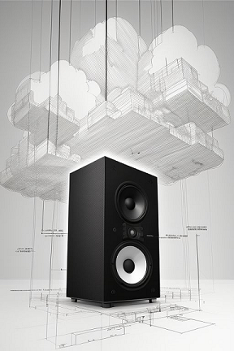
# Como embarcar um éter

**Resumo**: Esse documento reúne todos os passos e explicações sobre como colocar `Eutherpe`
dentro de um `Raspberry Pi`. Caso você esteja querendo tentar embarcá-la em outras placas
que não uma `Raspberry Pi`, pode buscar se orientar por aqui também para encontrar soluções
de eventuais impasses que você possa vir enfrentar. Entretanto, esse texto é direcionado
para pesssoas (técnicas ou não) que compraram um `Raspberry Pi` e querem usá-lo para
tocar música via `Eutherpe` e ficarem bem longe do `Desktop` e da desculpa de usar o distrativo
`(un)smartphone` pois "no `Desktop` é pior".

## Tópicos

- [Do que você vai precisar](#do-que-você-vai-precisar)
- [O Raspberry Pi Imager](#o-raspberry-pi-imager)
- [Todos a bordo](#todos-a-bordo)
    - [O que faremos](#o-que-faremos)
    - [Instalando o Raspbian basicão e sem-frescura](#instalando-o-raspbian-basicão-e-sem-frescura)
    - [These boots are made for walking](#these-boots-are-made-for-walking)
- [Parabéns, você embarcou um éter](#parabéns-você-embarcou-um-éter)
- [FAQ e resolução de problemas](#faq-e-resolução-de-problemas)
    - [É possível usar o meu Raspberry com Eutherpe embarcada em conjunto com outros softwares?](#é-possível-usar-o-meu-raspberry-com-eutherpe-embarcada-em-conjunto-com-outros-softwares)
    - [Como eu atualizo a versão da minha Eutherpe na minha placa?](#como-eu-atualizo-a-versão-da-minha-eutherpe-na-minha-placa)
    - [Perdi o acesso Wi-Fi à Eutherpe](#perdi-o-acesso-wi-fi-à-eutherpe)
    - [Configurei uma senha de acesso mas me esqueci dela](#configurei-uma-senha-de-acesso-mas-me-esqueci-dela)
    - [Eu não uso somente uma Wi-Fi, viajo bastante e estou sempre transitando entre uma rede e outra, existe uma forma de fazer Eutherpe conviver com essas mudanças de conectividade?](#eu-não-uso-somente-uma-wi-fi-viajo-bastante-e-estou-sempre-transitando-entre-uma-rede-e-outra-existe-uma-forma-de-fazer-eutherpe-conviver-com-essas-mudanças-de-conectividade)

## Do que você vai precisar

Para embarcar `Eutherpe` você vai precisar de:

- Um `desktop` ou `laptop` rodando `Linux`, `Windows` ou mesmo `Darwin` (a.k.a `MacOS`).
- Ter o programa `SSH` instalado nele (provavelmente você já deve ter).
- Um `Raspberry Pi`. Pode ser um `Raspberry Pi 3B+`, um `Raspberry 4B` ou um `Raspberry 5B`. Vai
  do seu bolso e dispobibilidade. Sugiro que você dedique ele para tocar música, ou seja,
  exclusivamente para rodar a nossa musa `low-profile` e etérea. :sunglasses: Se para você for
  interessante saber, originalmente eu embarquei `Eutherpe` numa `4B`.
- Uma fonte de alimentação para a sua plaquinha, sim, para o seu amado `Raspberry`, acredite,
  você passará ter fortes sentimentos por essa coisa simples e direta ao assunto. :wink:
- Dissipadores para colocar em cima dos componentes que mais emanam calor no seu `Raspberry`. É
  um `ARM`, esquenta bem pouco, além do que `Eutherpe` faz consumir pouca `CPU`, mas mesmo assim é
  uma boa prática procurar evitar esquentar a sua placa para que ela tenha uma boa vida útil.
- Se possível eu sugiro você investir num case também, pois já é um investimento comprar a placa,
  então compre um case para protegê-la.
- Um cartão `microSD` de pelo menos uns `16GB`.
- Um `pen drive USB`.

Se você escolheu o `Raspberry 5B` eu acredito que ele dê conta de suportar mais coisas embarcadas
nele que não `Eutherpe`, contudo, tem uns poréns, segue o `how-to` que você saberá. O `3B+` tem
fama de ser lentinho, eu nunca embarquei `Eutherpe` nele, se você fizer, me avisa como foi e
também a sua experiência ouvindo suas músicas nele. Valeu! :wink:

[`Voltar`](#tópicos)

## O Raspberry Pi Imager

Você precisa instalar o `Raspberry Pi Imager` no seu `desktop/laptop`. Escolha o download que
melhor se aplicar ao seu estado de coisas  [:point_right: aqui](https://www.raspberrypi.com/software/).
A instalação é bem direta ao assunto, acredito que você fará isso em minutos! Você é "ráque"!

[`Voltar`](#tópicos)

## Todos a bordo

Finalmente iremos começar! A ideia é te segurar o mínimo aqui para você ir escutar música e
desligar tudo por aqui. Parar para escutar, desacelerar, pescou? :wink: E o melhor: totalmente
`off-line` MuHHAuAHuHAuHAuAHUAHUAhUAHUAHUAH!!!!!!! Acredite, em tempos esses (`2024`) é super
legal ser ilhado e diferente. Crusoé seria o cara mais esperto e vanguardista do mundo todo e
(des)afim...

[`Voltar`](#tópicos)

### O que faremos

> [!IMPORTANT]
> Antes de ligar o seu Raspberry Pi coloque os dissipadores em cima dos
> componentes que mais esquentam. O YouTube está [repleto de vídeos](https://www.youtube.com/results?search_query=colocando+dissipadores+no+raspberry+pi)
> que ensinam como fazer isso. Dê uma procurada nisso antes e faça, para só
> então prosseguir.

Pois bem, nós executaremos alguns passos que depois com a prática se tornarão bem simples e
você nem precisará mais ler isso aqui:

- Via o `Raspberry Pi Imager` instalar o sistema operacional básico no cartão `microSD`.
- Colocar o cartão `microSD` no seu `Raspberry Pi` e ligá-lo.
- Utilizando `ssh`, acessar o seu `Raspberry Pi` (caso você não seja uma pessoa técnica,
  te ensinarei como conjurar esses encantamentos, não irei soltar da sua mão em nenhum minuto,
  acredite :wink:).
- Já dentro do `Raspberry Pi`, baixar o código-fonte de `Eutherpe`.
- Construir `Eutherpe` e instalar tudo que essa mina precisa e ela junto também na sua plaquinha.
- O seu `Raspberry` vai reiniciar, você vai plugar o `pen drive USB` contendo suas músicas e vai
  acessar o `miniplayer Web` de `Eutherpe` e depois perder totalmente o interesse nesse
  texto aqui e em mim.

A ideia é essa! Deixar você em paz, para curtir a `sua` música. Se de fato acontecer isso: o meu
trabalho vai ter sido feito! :sunglasses: "Desorganizando um pouco para te organizar"... :wink:
Como já dizia um famoso filósofo da Antiguidade:

>"Propaganda e informação demais é sempre um :ok_hand:! Tem uma hora que é imprescindível dizer: chega dessa merda!"

[`Voltar`](#tópicos)

### Instalando o Raspbian basicão e sem-frescura

Ponha o `microSD` naquele adaptador que deve ter vindo com ele e espete-o na controladora
`SD` que você tem no seu `desktop` ou `laptop`.

Abra o `Raspberry Pi Imager`. Se você não fez o [`download` dele](https://www.raspberrypi.com/software/), faça e instale-o. Na página dele
tem tudo o que você precisa para fazer isso.

Ao abri-lo você verá a tela ilustrada pela **Figura 1**. Nessa tela você precisará clicar em
quatro botões, respectivamente: `CHOOSE DEVICE`, `CHOOSE OS`, `CHOOSE STORAGE` e `NEXT`.

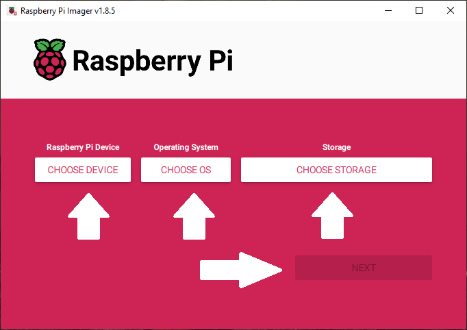

**Figura 1**: A tela principal do `Raspberry Pi Imager`.

O botão `NEXT` só vai habilitar depois que você passar pelos três primeiros. Então vamos que
vamos *mas nessa ordem...*

Quando você clicar em `CHOOSE DEVICE` vai abrir uma tela listando as placas para você escolher.
Você deve escolher a versão da sua placa `Raspberry Pi`. No meu caso aqui eu escolhi `Raspberry
Pi 4`, adapte ao seu estado de coisas. Dê uma olhada na tela que vai abrir se guiando pela
**Figura 2**.

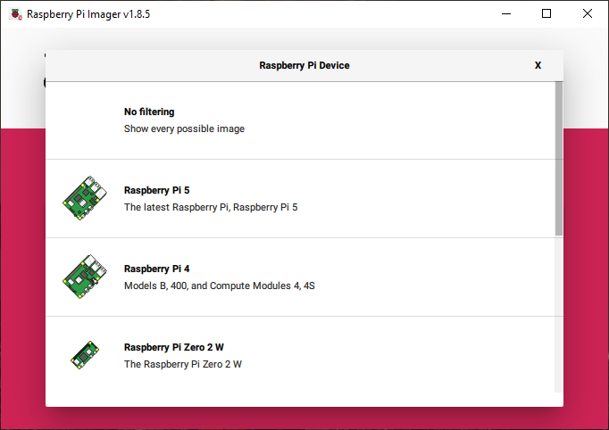

**Figura 2**: A tela onde você escolhe a versão da sua placa.

Depois você clicará em `CHOOSE OS` e irá abrir a tela ilustrada pela **Figura 3**. Nessa tela
é onde você vai escolher qual sistema operacional vai rodar no seu `Raspberry Pi`. No caso desse
`guia` estamos assumindo que teremos uma placa dedicada para reproduzir música e emaná-la via
`Bluetooth` (caso você queira). Então escolha `Raspberry Pi OS (other)`. Finalmente vai ser exibida
a tela para você escolher qual tipo específico de sistema operacional você quer, aqui escolheremos
um ambiente baseado em texto, sem nenhum fru-fru de janelinha. Algo econômico para liberar recursos
para reproduzir sua música sem engasgos, confira a **Figura 4**!

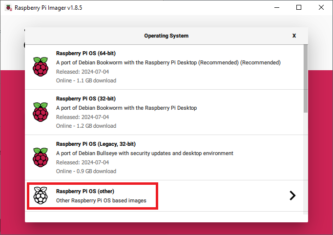

**Figura 3**: Nessa tela você deve escolher `Raspberry Pi OS (other)`.

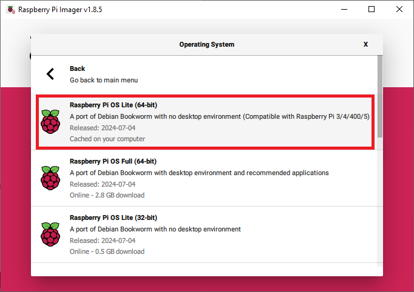

**Figura 4**: Escolha `Raspberry Pi OS Lite (64-bit)`, vamos fazer algo enxutão, sem nenhuma frescura.

Com a versão da placa e tipo do sistema operacional escolhidos, resta indicar onde gravar esse
sistema. Para fazer isso clique em `CHOOSE STORAGE`. Vai ser exibida a tela ilustrada na
**Figura 5**. Clique sobre o dispositivo listado que se refira ao seu `microSD`.

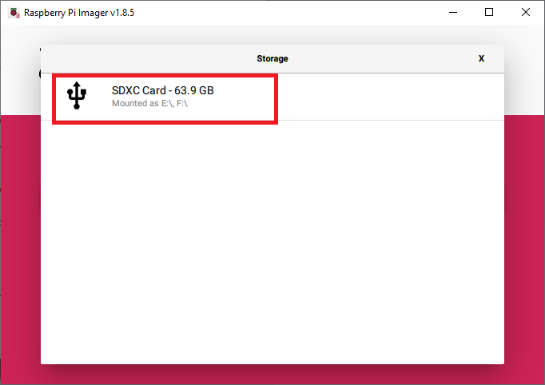

**Figura 5**: Essa tela vai listar o seu cartão `microSD`, apenas clique sobre ele.

O botão `NEXT` finalmente ficará habilitado, dê uma olhada na **Figura 6**. Nesse ponto, apenas
clique nele!

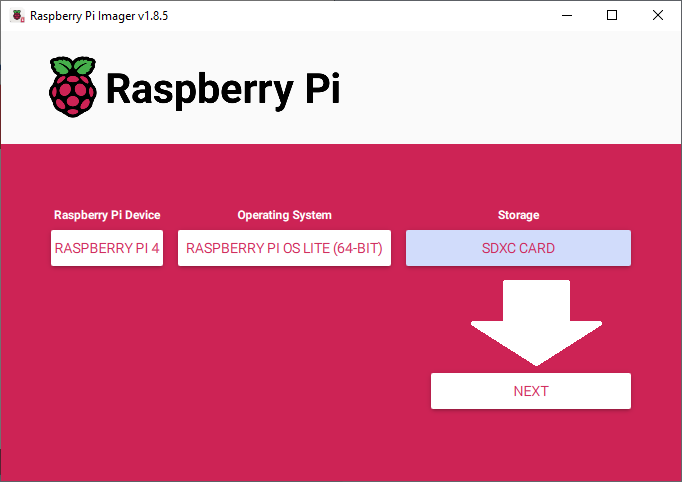

**Figura 6**: Com tudo escolhido é só gravar o sistema operacional no seu cartão `microSD`.

Quando você clicar em `NEXT` abrirá uma tela perguntando se você quer fazer customizações para
já passarem valer no momento que você ligar o `Raspberry Pi` pela primeira vez. Isso é muito
conveniente, pois, vai facilitar o acesso ao computador via o seu `desktop`/`laptop`. Clique
em `EDIT SETTINGS`. Veja a **Figura 7**.

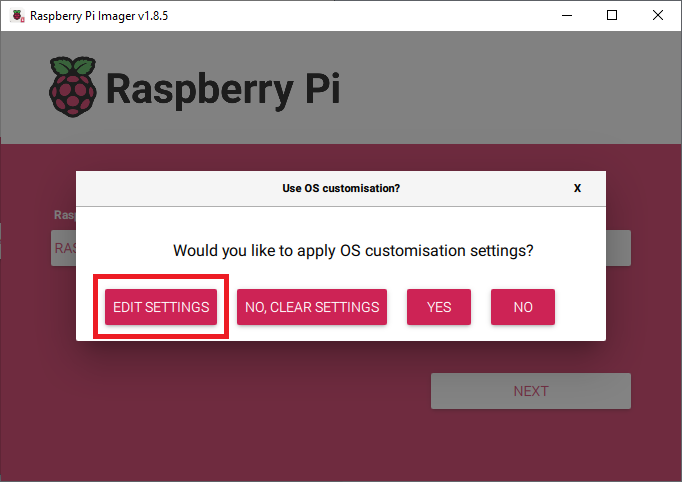

**Figura 7**: Clique em `EDIT SETTINGS` para abrir a tela de customizações.

Na tela que abrir você precisa marcar as quatro caixas de checagem ressaltadas na **Figura 8**.
Preenchendo o `hostname` para um nome que você possa "chamar" o seu `Raspberry Pi` na rede. Definir
um `username` e `password` (no caso às vezes algo diferente de `pi` não funciona, se deixar
o que já tiver, a senha será `raspberry`). Em `SSID` e `Password` você deve colocar o nome
do sua `Wi-Fi` e a senha dela respectivamente. Isso é importante pois assim você poderá acessar
o seu `Raspberry Pi` via seu computador pessoal. A configuração de `timezone` não é tão importante,
pois, o `Raspberry Pi` (excluindo o 5) não tem bateria e por isso não salva a hora, mas se você
quiser, vai lá... Depois é só clicar na guia `SERVICES`. Vai abrir uma tela similar à **Figura 9**.

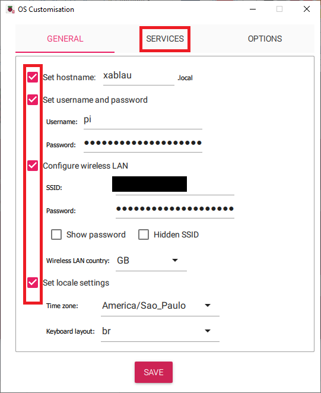

**Figura 8**: A tela onde você faz as suas customizações.

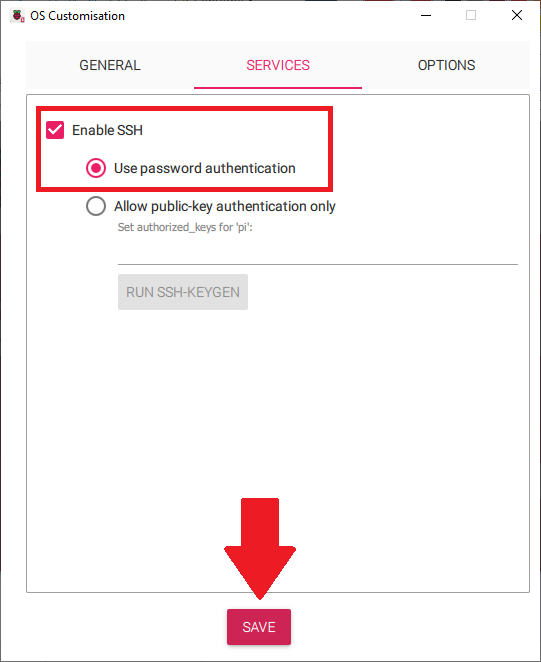

**Figura 9**: Finalizando as customizações.

Na guia `SERVICES` marque a opção `Enable SSH` e escolha `Use password authentication` e por fim,
clique em `SAVE`.

Nisso, vai aparecer o aviso da **Figura 10** dizendo que o processo vai apagar tudo que tem dentro
do `microSD` para gravar nele o sistema operacional do seu `Raspberry Pi`. Ele está querendo saber
se você está de acordo, só clicar `YES`.

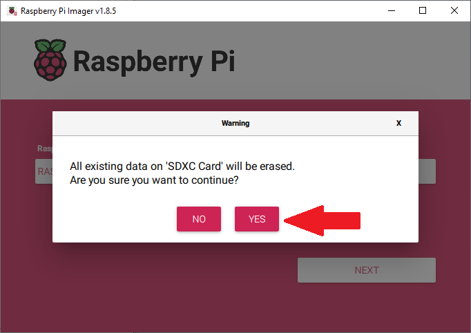

**Figura 10**: Clique `YES` para começar copiar a imagem do sistema operacional.

Primeiro vai aparecer uma barra de progresso dizendo que está escrevendo, veja a **Figura 11**.

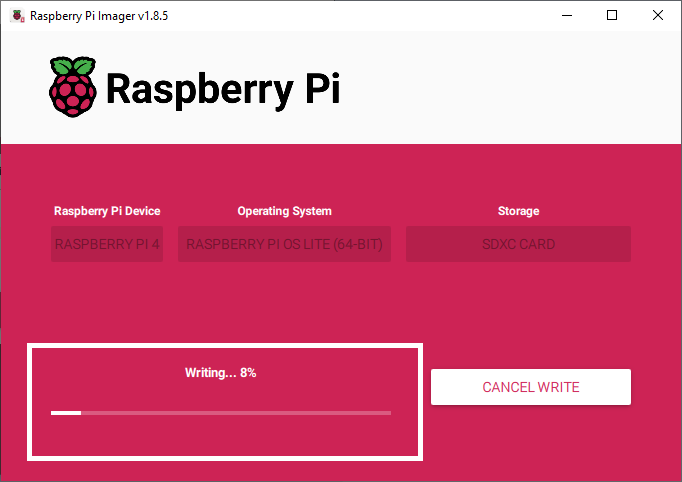

**Figura 11**: Escrevendo o `OS` no seu `microSD`.

Depois vai aparecer uma barra de progresso dizendo que está verificando a integridade da imagem
criada no `microSD`. Confira a **Figura 12**.

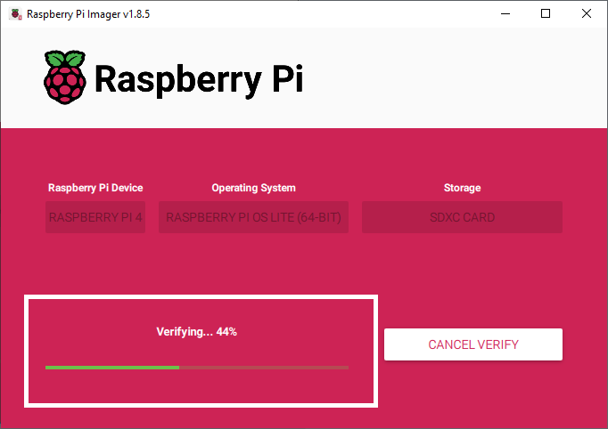

**Figura 12**: Espere pela verificação.

Se tudo ocorreu conforme, você terá o aviso dizendo que o sistema operacional que você escolheu
foi escrito para o `microSD` e que você já pode removê-lo, dá uma olhada na **Figura 13**.

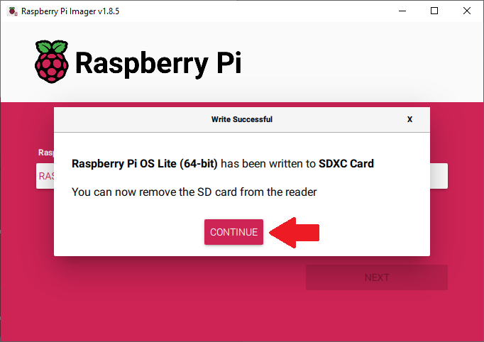

**Figura 13**: O seu `microSD` já está pronto para ser encaixado na sua placa!

Pronto! Você já tem um sistema para dar vida ao seu `Raspberry Pi`. Agora é só encaixar
o `microSD` na área da sua placa que tem o contato para ele (com os "dentinhos" para o lado de
cima). Ligar o `Raspberry Pi` à fonte de alimentação e você acabou essa parte! Mandou bem e nem
doeu, parabéns!

[`Voltar`](#tópicos)

### These boots are made for walking

Agora é fazer o processo de `bootstrapping` de `Eutherpe` (estou assumindo que você já se informou
sobre [aqui](https://github.com/rafael-santiago/eutherpe/blob/main/doc/MANUAL-PT.md)).

Para isso você terá que acessar o seu `Raspberry Pi` via `SSH`. Estando o seu computador
conectado a mesma rede local do `Raspberry Pi` (leia-se a "sua Wi-Fi"), abra um `prompt de
comando` se você estiver no `Windows` ou um `Terminal` caso esteja no `Linux` ou ainda um
`Terminal app` se estiver no `MacOS`.

E digite:

```console
_ ssh <username>@<hostname>
```

Caso esteja em dúvida de qual `hostname` você deu ao seu `Raspberry Pi`, consulte a **Figura 8**
para se lembrar onde está essa informação, bem como o `username`.

No meu caso, seguindo o exemplo aqui seriam:

```console
ssh pi@xablau.local
```

Se aparecer um aviso pedindo confirmação yes/no, digite "yes" e dê enter. Logo depois ao te
pedir a senha digite a senha que você definiu para o usuário.

Logo em seguida, você digitará:

```console
_ sudo su
```

Isso te dará poderes de superusuário e você não poderá sair por aí voando usando calcinha/cueca
por cima da calça, mas poderá alterar o sistema com mais liberdade e nós vamos de fato precisar
fazer isso! :wink:

Se você agora tiver poderes de superusuário notará o símbolo `#` do lado do `prompt`:

```console
pi@(...)# _
```

Agora nós vamos instalar o aplicativo `git` e com ele baixaremos o código-fonte de `Eutherpe`:

```console
# apt install git -y
```

Após concluir a instalação baixe os fontes de `Eutherpe` da seguinte forma:

```console
# git clone https://github.com/rafael-santiago/eutherpe -b v1
```

Depois entre no diretório com os fontes:

```console
# cd eutherpe
```

Estando dentro do diretório `eutherpe` rode o `bootstrap`:

```console
# ./bootstrap.sh
```

Ao executar o script `bootstrap.sh` ele vai de cara te confirmar se você quer realmente
fazer o `bootstrap`, algo como:

>Do you want to bootstrap your system? [y/n]

Nesse ponto é só teclar "y".

Logo depois o `bootstrap` vai te perguntar se você quer alterar a `porta default` de acesso
ao player `Eutherpe` via `web`:

>Do you want to change Eutherpe's default listen port (8080)? [y/n]

A `porta default` é a `8080`. Eu deixaria essa, mas caso queira, confirme teclando "y" e depois
digite a sua porta de escolha e confirme-a teclando enter.

O `bootstrap` nesse ponto vai detectar que você está embarcando `Eutherpe` dentro de um
`Raspberry Pi` e vai te perguntar se você quer configurar uma interface `ethernet` de resgate.
O que ele fará é colocar um endereço fixo na placa de rede de seu `Raspberry Pi` (`42.42.42.1`)
e um reserva `42.42.42.2`. Se por algum motivo você perder acesso via `Wi-Fi` ao seu `Raspberry Pi`,
você ainda poderá via conexão cabeada (`ponto-a-ponto`) acessá-lo via o ip `42.42.42.1` ou
`42.42.42.2`. Eu acho bem conveniente fazer.

Por que configurar dois IPs e cada um em uma placa `Ethernet`? Bom a ideia por trás do conceito da
interface de resgate é nunca te deixar na mão. Por experiência própria, o meu `Raspberry Pi` veio
de fábrica com a interface `Ethernet` com mau contato. Daí eu acabei precisando comprar uma
interface `Ethernet Gigabit USB` para espetar na minha placa. A necessidade é a mãe da invenção.
A ideia inicial era oferecer apenas um IP de resgate, mas acabei tornando o sistema de resgate
mais resiliente por conta desse problema do mau contato. Eu as configuro de um jeito que quando
você espeta uma outra interface `Ethernet` e então pluga o cabo de rede, o sistema operacional vai
automaticamente chavear a rota para essa interface ao invés de usar a placa de rede on-board para
isso. Porém, no geral você vai conseguir pingar os dois IPs independente de ter o cabo espetado na
placa de rede on-board do seu `Raspberry` ou em uma externa igual a minha `Gigabit`.

Sim, `O Guia do Mochileiro das Galáxias` foi minha inspiração para esses endereços `IP`.

O `bootstrap` te perguntará algo como:

>Do you want to set up a rescue ethernet interface? [y/n]

Se quiser, tecla "y".

Ao detectar que o `bootstrap` vai rolar a partir de um `Raspberry Pi` ele também te perguntará
se você deseja configurar a `Wi-Fi`:

>Do you want to set up the Wi-Fi? [y/n]

Aqui você vai escolher "n", pois a sua `Wi-Fi` já foi configurada via o `Raspberry Pi Imager`,
lembra? :sunglasses: Tanto que você inclusive já está conectada(o) dentro da sua plaquinha, via
sua `Wi-Fi`.

Depois disso é só observar. Tudo vai ser posto no jeito e por fim o seu `Raspberry Pi` será
reiniciado. Uma vez reiniciada a sua musa sem frescuras estará pronta e a sua espera!

Plugue um `pen-drive USB` na sua placa acesse `http://eutherpe.local:8080/eutherpe` (caso tenha
alterado a `porta default` substitua `8080` por sua escolha). Caso não saiba utilizar o
`miniplayer web` de `Eutherpe` dê uma lida no [`manual`](https://github.com/rafael-santiago/blob/main/doc/MANUAL-PT.md).
Acredito que ele é bem intuitivo e direto ao ponto, então cutucando-o, você também aprenderá.

[`Voltar`](#tópicos)

## Parabéns, você embarcou um éter

Pronto você embarcou um "éter musical" numa placa e eu espero que esse éter te flutue para bem
longe de telas, propagandas, excessos e para mais perto de sons e do que de bom eles te evoquem.

No início talvez seja estranho: ficar mais ouvindo do que cutucando uma tela ou esperando
a próxima propaganda ou sugestão chata que esfria seu `flow` musical. Entretanto, insista que
em breve você se desentoxica e vai reaprendendo um hábito simples que ultimamente tem ficado
bem poluído e papagaiado.

No início pode ser difícil perceber que não se está pastando propaganda enquanto se ouve um pouco de
música entre um pasto e outro. Mas é possível e você não precisa me pagar nada. Pague os artistas
que compõem, gravam seus álbuns favoritos e prestigie-os em shows. Aproveite e divirta-se, num mundo
`3D` e real para além das telas, rodeada(o) por gente de verdade ao invés de soMENTE avatares! :wink:

Para mim você é um ser humano não um boi ou uma vaca! Não te quero pastando nada para pingar centavos
de propaganda para mim, prefiro ganhar a vida sem usar as pessoas como meros trampolins para lances
escusos que envolvam seus gostos, hábitos e informações pessoais... :herb: :cow: :headphones: :money_with_wings: :milky_way: :moneybag: :alien: :point_left: :satisfied:
Chega dessa porra, a *Internet* precisa voltar a ser legal de novo...

Sou totalmente a favor da dignidade da pessoa humana, inclusive virtualmente, não sou o que se diz
popularmente por aí: "duas conversa". Programar para mim é como escrever ensaios. Eu me expresso sobre
preferências e crenças mesmo que de forma *não livre de contexto*, mas ainda sim, isso para mim é
uma linguagem que excede simplesmente a mera programação e tecnicidade, minhas ideias e ideais nos
meus códigos em muitos momentos eclodem e eu prezo por isso. Amo detalhes e são nos detalhes onde
moram meus protestos, sarcasmo (não sou perfeito), críticas e opiniões. Ao usar esse `software`
você **não está firmando** um pacto faústico. Sem letrinhas miúdas... Eu quero simplesmente te mostrar por
`A+B`, na melhor forma de teorema na computação (verdade cabal, leia-se um programa desempenhando
bem a coisa idealizada, para tirar da frente, na base da voadora argumentativa, gente com
conversinha mole contrária), que você **tem sim o direito de ouvir música sem propaganda, sem precisar
ficar pagando resgate para os seus ouvidos e saco que de propaganda já deve estar bem
desconfortavemente cheio!**

Nisso, você pode estar a pensar:

>"Então tu escreveu `Eutherpe` e `Euther-PI` como uma espécie de `QED` computacional sobre como
> ouvir música está um ato bem bosta nesses últimos anos, dado apenas o lucro a todo custo e que
> mesmo assim é possível se libertar disso e se reconectar com o puro hábito de ouvir música
> criando algo bem direto e em casa e sendo proativo em largar, para sempre, o que está fedendo
> o ato de escutar nossas músicas, Rafael?"


... e sim também: muitos dos abusos cometidos por empresas é por culpa dos consumidores. Se ao serem (mesmo que de forma velada) tratados
como gado, ou destratados, ou usados, percebessem e não voltassem, esses modelos de negócio "mente do mal"
jamais iriam para frente. Muito é culpa dos usuários que tudo aceitam. Não acostume-se a comer
bosta, você pode depois de um tempo acreditar piamente que é uma ganache orgânica e ficar brava(o)
com pessoas que tentem te provar o contrário... ou fazer você parar de PROVAR o contrário... :satisfied:

Não reduza suas amadas canções a pano de fundo para propagandas! Tenha amor pelo seu saco e pelo que te faz bem e te emociona.

Seja a resistência, lute para não se robotizar. Controle suas escolhas, seja crítico, opine, mantenha sua individualidade, seus
ideais e sentimentos isso é o que te diferencia de meras máquinas. Seja humano e com isso pilote de forma mais arguta e consciente
as suas máquinas.

Perceba ainda: o ramo de `software` tem o péssimo hábito de chamar seus clientes de "usuários"...
Por isso, muito cuidado com quem nesse ramo você se mete.

Por fim, após me provocar com esses pensamentos, em alguns meses eu saí disso:

<td border></td>

...para o meu amado monólito! :sunglasses::

<table>
    <tr>
        <td>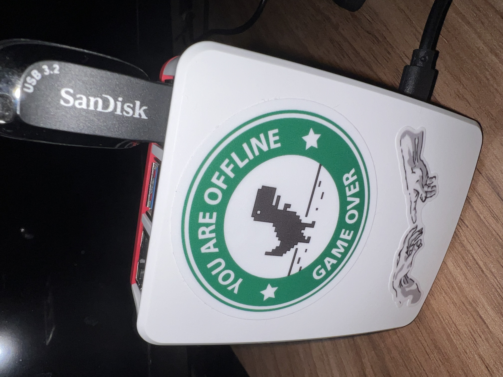</td>
        <td>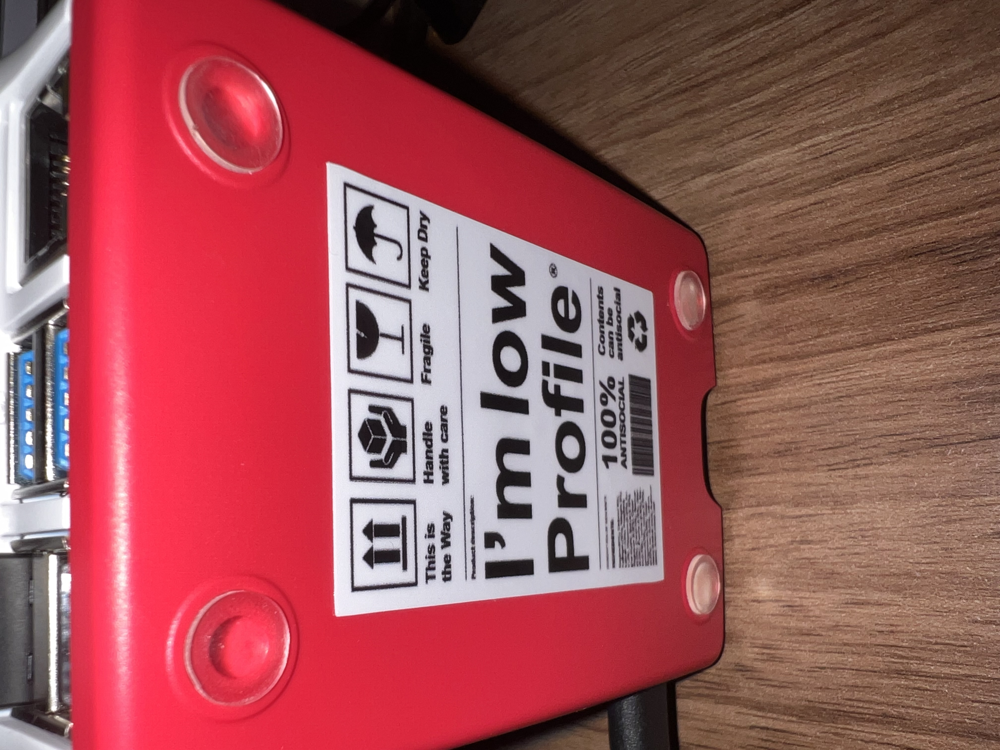</td>
        <td></td>
    </tr>
</table>

O caminho está pavimentado, espero que você possa fazer essa transição mais rápido que eu e
ter um monólito desse em casa. Caso um dia você acorde com vontade de *SÓ ouvir SUA música* sem interrupções,
liga a sua `Euther-PI` e dê uma chance para essa musa, você pode curtir e não largar mais dos
encantos dela! :wink:

-- Rafael

[`Voltar`](#tópicos)

## FAQ e resolução de problemas

### É possível usar o meu Raspberry com Eutherpe embarcada em conjunto com outros softwares?

Depende da sua placa e do que você quer pôr em conjunto para rodar. Pense que se você quer realmente
ter um dispositivo para tocar música é interessante prezar por uma experiência auditiva boa. Se
você puser muita coisa para rodar em concorrência com `Eutherpe` você pode começar a ter muito
atraso, som picotado etc. Isso é péssimo ao ouvir música por meios digitais.

Outra coisa é que por prezar pela experiência auditiva eu passei por um périplo lutando contra
a ruindade sem fim do `Pulseaudio` e do `Pipewire/WirePlumber`. No final das contas depois
de meses lutando com essas tecnologias que mais consumiam recursos do `Raspberry` do que de
fato entregavam uma boa experiência, decidi tomar um rumo oposto ao *status quo* (2024) com
`bluetooth` no `Linux`, resolvendo abraçar `ALSA` e `Bluez-ALSA`. Nisso, se você de fato quiser
colocar aplicações que utilizem som e conectividade `bluetooth`, elas não funcionarão bem com
`Eutherpe`, pois provavelmente essas aplicações devem utilizar aquele monte de tralha `Pulseaudio`
ou `Pipewire`. Eu vou além, `Eutherpe` não coexistirá com elas. Caso queira entender sobre meu
périplo com `Bluetooth` no `Linux` você pode ler mais em [`"The Linux Bluetooth Blues"`](https://github.com/rafael-santiago/eutherpe/blob/main/doc/THE-LINUX-BLUETOOTH-BLUES-PT.md).

No quesito performance eu arriscaria dizer que com o `Raspberry Pi 5B` você pode ter uma
boa performance rodando `Eutherpe` e uma outra tarefa que não envolva mexer com som e `Bluetooth`.
Deixe o som e o `bluetooth` do seu `Raspberry` para `Eutherpe`.

[`Voltar`](#tópicos)

### Como eu atualizo a versão da minha Eutherpe na minha placa?

Uma vez que você embarcou e já está tudo funcionando. Tudo que você precisa fazer é:

1. Se conectar ao seu `Raspberry Pi`.
2. Adquirir poderes de superusuário.
3. Remover uma possível cópia antiga dos fontes de `Eutherpe`.
4. Baixar os fontes da versão nova.
5. Rodar o update.

Isso agora passo a passo, na forma de comandos efetivos para você ter a coisa feita.

>Se conectar ao seu `Raspberry Pi`

```console
_ ssh <username>@<hostname ou ip do seu raspberry>
```

>Adquirir poderes de superusuário

```console
$ sudo su
```

>Remover uma possível cópia antiga dos fontes de `Eutherpe`

```console
# rm -rf eutherpe
```

>Baixar os fontes da versão nova (assumindo v42)

```console
# git clone https://github.com/rafael-santiago/eutherpe -b v42
```

>Rodar o update

```console
# cd eutherpe/src && make update
```

Pronto, agora digite `~.` e você se desconectará do seu `Raspberry Pi` e ele já estará rodando a
versão que você baixou. Aproveite a nova versão com suas melhorias e/ou novos recursos! :wink:

Viu só? Você é "ráque"! :satisfied:

[`Voltar`](#tópicos)

### Perdi o acesso Wi-Fi à Eutherpe

Aqui é que você vai começar ver vantagem em configurar uma `interface de resgate`. No caso
a solução aqui parte do princípio que durante o `bootstrapping` você optou por isso. Caso não,
eu sugiro você refazer a instalação de `Eutherpe` agora escolhendo configurar uma interface de
resgate, em suma é só você escolher "sim" e tudo será feito automagicamente...

Você precisa de um cabo `ethernet` e de um `desktop` ou um `laptop` que disponha de uma placa de
rede `ethernet`. No caso em lojas onde se vende materiais elétricos/eletrônicos você tende
encontrar esses cabos já crimpados. No caso você precisa de um cabo do tipo `CAT6` ou mesmo
`CAT5/5e`. Dê uma olhada na **Figura 14**.

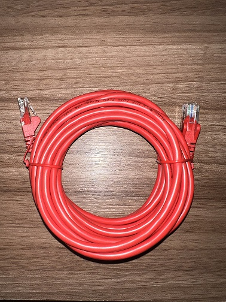

**Figura 14**: Cabo ethernet para você criar a rede ponto-a-ponto.

Para início de conversa, você precisa configurar a placa de rede de seu `desktop`/`laptop`
para que esteja na mesma rede `ethernet` do seu `Raspberry Pi`.

No caso você precisa colocar as seguintes informações nas configurações de rede da
sua placa de rede:

- Endereço coloque `42.42.42.84` (pode ser algo entre `42.42.42.3/254`).
- Máscara de rede ponha `255.255.255.0`.

A forma como isso é configurado vai depender do sistema operacional. Na **Figura 15** segue
como isso pode ser feito no `Windows`.

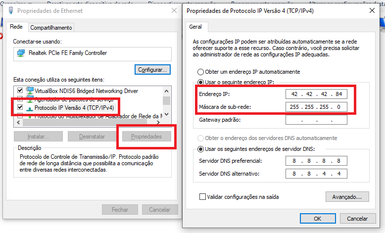

**Figura 15**: Configurando a rede ponto-a-ponto no seu computador (Windows).

Uma vez que você pôs o IP `42.42.42.84` no seu computador, você precisa apenas criar uma rede
ponto-a-ponto entre o seu computador e o `Raspberry Pi`. Para fazer isso você vai usar
o cabo `ethernet` ligando as duas placas `ethernet` com o cabo de rede.
Uma ponta do cabo vai no computador e a outra no `Raspberry`. Ao conectar as pontas,
você vai notar que as luzes na interface de rede do seu `Raspberry Pi` irão acender.
Dê uma olhada na **Figura 16**.

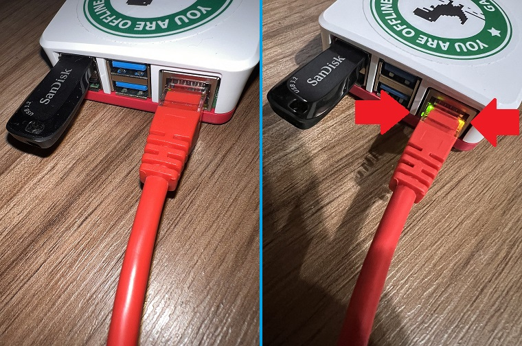

**Figura 16**: Conectando as pontas do cabo de rede.

Por padrão `Eutherpe` ao iniciar tenta pegar um IP via `Wi-Fi`, se depois de dois minutos ela
não conseguir, ela vai passar a funcionar no `IP` da interface de resgate, se você conectou
via a placa de rede `on-board` do seu `Raspberry Pi` o endereço de acesso será `42.42.42.1`.
Se você está usando uma placa de rede externa, o endereço será `42.42.42.2`. Então supondo
que o seu acesso é `http` via porta `8080`, acesse no seu web browser:
`http://42.42.42.1:8080/eutherpe` ou `http://42.42.42.2:8080/eutherpe`.

Uma vez que você acessar `Eutherpe` via seu navegador, apenas vá em `SETTINGS` e reconfigure
sua `Wi-Fi`, salve as alterações e depois clique em `REBOOT`. Desconecte o cabo de rede e
espere `Eutherpe` reiniciar. Se o acesso à `Wi-Fi` voltar você já poderá acessá-la normalmente
como de costume (via o nome `.local` que você configurou ou IP que você está acostumada(o)).

[`Voltar`](#tópicos)

## Configurei uma senha de acesso mas me esqueci dela

Para resetá-la, existem três formas:

- Você pode refazer o seu cartão `microSD`. Se o seu `Raspberry Pi` estiver dedicado à `Eutherpe`,
você não correrá o risco de perder nada (levando em conta que você fez `backup` das suas `playlists`,
caso as tenha).

- Se tiver configurado uma interface de resgate, poderá se valer dela para acessar o seu `Raspberry`
via `ssh`. Se for esse o caso, segue lendo.

- Você ainda pode utilizar o nome `.local` que configurou para identificar `Eutherpe` na rede de
sua casa. O processo é igual, segue lendo.

### Quero resetar a minha senha via interface de resgate ou mDNS

A parte de estabelecimento da rede ponto-a-ponto via `interface de resgate` você pode
seguir em ["Perdi o acesso Wi-Fi à Eutherpe"](#perdi-o-acesso-wi-fi-à-eutherpe), uma vez o
cabo conectado e a rede funcionando, você volta aqui.

Depois que você configurou a rede, basta iniciar um:

- `Prompt de comando` se você estiver no `Windows`.
- `Terminal` se você estiver no `Linux`.
- `Terminal App` se você estiver no `MacOS`.

Nele você vai abrir uma conexão `SSH` com o seu `Raspberry Pi` via `interface de resgate`. Da
seguinte forma:

```console
_ ssh pi@42.42.42.1
```

Se você quiser utilizar o `.local` (`mDNS`) você vai digitar (assumindo que você deixou o nome
`default` que é `eutherpe.local`):

```console
_ ssh pi@eutherpe.local
```

**Observação para as marinheiras(os) de primeira viagem de linha de comando**: é preciso pressionar
`ENTER` para executar o comando...

Depois disso vai ser pedida uma senha, se você estiver se conectando ao `IP` pela primeira vez,
antes da senha você terá que confirmar digitando `yes`.

Digitada a senha, você entrará dentro do terminal de seu `Raspberry Pi`, terá algo como:

```console
(...)$ _
```

Digite `sudo su` e pressione `ENTER`. Você agora verá algo como:

```console
(...)# _
```

A tralha no final do `prompt` indica que você agora é um usuário `root`. Podendo fazer o que
bem entender no sistema.

Usando das suas prerrogativas `root`, você digitará os seguintes encantamentos (ao fim de cada
encantamento, você pressionará `ENTER`):

```console
# systemctl stop eutherpe
# cd /etc/eutherpe
# sed -i 's/"Authenticated":true/"Authenticated":false/g' player.cache
# sed -i 's/"HashKey":".*"/"HashKey":""/g' player.cache
# systemctl restart eutherpe
# exit
# exit
```

Depois disso você já terá desconectado do terminal de `Eutherpe` e poderá tentar acessar o
`miniplayer` via seu navegador, se tudo ocorreu conforme, a senha não será mais requisitada.
Caso você a reabilite, a senha será agora a `default`: `music`.

[`Voltar`](#tópicos)

## Eu não uso somente uma Wi-Fi, viajo bastante e estou sempre transitando entre uma rede e outra, existe uma forma de fazer Eutherpe conviver com essas mudanças de conectividade?

Existe uma forma de você registrar credenciais `Wi-Fi` no seu próprio `Pen-drive USB`. Caso ao
tentar ingressar na rede local, `Eutherpe` perceba a presença desse arquivo especial, ela vai
tentar entrar nas redes ali indicadas.

Na raíz de seu `Pen-drive USB` você precisa criar o arquivo `pub-aps` dentro das pastas `.eutherpe/wlan`.

Então o arquivo `.eutherpe/wlan/pub-aps` deve conter o seguinte conteúdo:

```
<Nome da rede Wi-Fi> <Senha>
```

Supondo que a rede `Wi-Fi` seja `HotelChiqueDasPulgasDouradas` e a senha `123321*!`.
Você teria um arquivo com o seguinte conteúdo:

```
HotelChiqueDasPulgasDouradas 123321*!
```

Agora é só espetar o `Pen-Drive` no seu `Raspberry Pi` e ligá-lo, espere um tempo e você
conseguirá acessar `Eutherpe` como já está acostumada(o).

Supondo que agora você vai passar uns dias no campo e te deram a seguinte informação para acesso
à rede `Wi-Fi` do hotel fazenda:

- Nome da rede: `HotelFazendaDaVaquinhaMóó`
- Senha: `123Móóóó*`

Basta você editar o arquivo `.eutherpe/wlan/pub-aps`, adicionando:

```
#HotelChiqueDasPulgasDouradas 123321*!
HotelFazendaDaVaquinhaMóóó 123Móóóó*
```

Note que foi adicionado o login para a `Wi-Fi` do hotel fazenda da vaquinha móóó e adicionada uma
tralha no início da entrada do login do hotel chique das pulgas douradas. Ao iniciar uma linha com
`#` você está comentando-a e com isso `Eutherpe` nem levará ela em conta. Uma boa prática é sempre
deixar comentados os logins em redes que não estão no momento disponíveis. Isso vai poupar tempo no
ingresso à `Wi-Fi` que interessa!

O ideal mesmo é você ter conectada a `Wi-Fi` básica (a rede que você mais acessa) via a imagem
criada pelo `Raspberry Pi Imager` ou via a configuração web de `Eutherpe`, lá na seção `SETTINGS`.
As demais (de provavelmente locais públicos), você pode usar o recurso de cache de
`.eutherpe/wlan/pub-aps`. Por que? Bem, as configurações básicas via `Pi Imager` e
`Eutherpe` armazenam as senhas de forma mais segura. A do `.eutherpe/wlan/pub-abs` você precisa
ingressar com a senha de forma exposta lá no arquivo `pub-abs`. O nome `pub-aps` já diz tudo:
`PUBlic-Access PointS`. O que é público não tem problema de expor, já que todo mundo sabe,
gotcha? :wink:

[`Voltar`](#tópicos)
