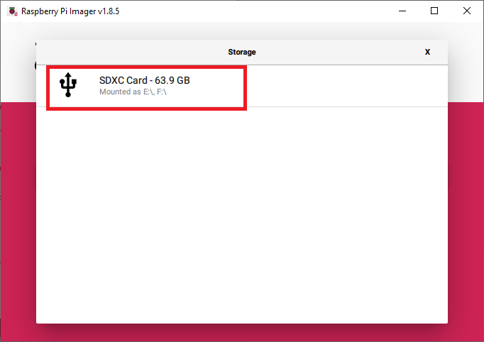
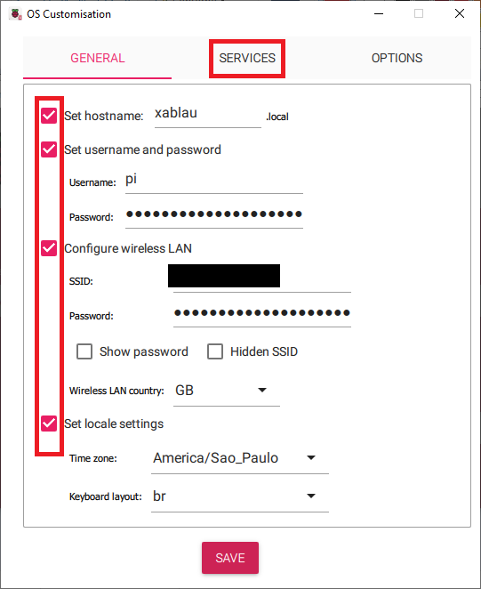
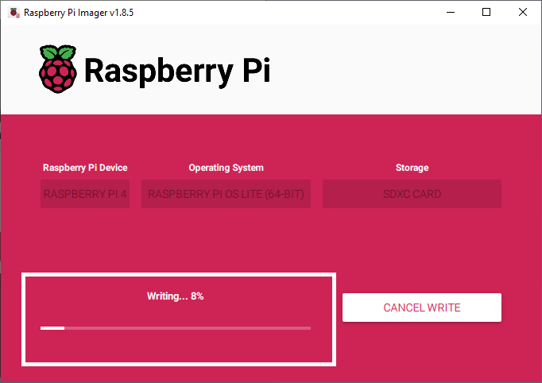
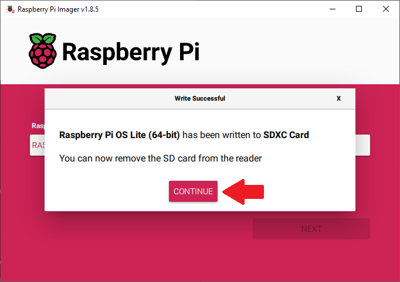

# Como embarcar um éter

**Resumo**: Esse documento reúne todos os passos e explicações sobre como colocar `Eutherpe`
dentro de um `Raspberry Pi`. Caso você esteja querendo tentar embarcá-la em outras placas
que não uma `Raspberry Pi`, pode buscar se orientar por aqui também para encontrar soluções
de eventuais impasses que você possa vir enfrentar. Entretanto, esse texto é direcionado
para pesssoas (técnicas ou não) que compraram um `Raspberry Pi` e querem usá-lo para
tocar música via `Eutherpe` e ficarem bem longe do `Desktop` e da desculpa de usar o distrativo
`(un)smartphone` pois "no `Desktop` é pior".

## Tópicos

- [O que você vai precisar](#o-que-você-vai-precisar)
- [O Raspberry Pi Imager](#o-raspberry-pi-imager)
- [Todos a bordo](#todos-à-bordo)
    - [O que faremos](#o-que-faremos)
    - [Instalando o Raspbian basicão e sem-frescura](#instalando-o-raspibian-basicão-e-sem-frescura)
    - [These boots are made for walking](#these-boots-are-made-for-walking)
- [Parabéns, você embarcou um éter](#parabéns-você-embarcou-um-éter)

## O que você vai precisar

Para embarcar `Eutherpe` você vai precisar de:

- Um `desktop` ou `laptop` rodando `Linux`, `Windows` ou mesmo `Darwin` (a.k.a `MacOS`).
- Ter o programa `SSH` instalado nele (provavelmente você já deve ter).
- Um `Raspberry Pi`. Pode ser um `Raspberry Pi 3B+`, um `Raspberry 4B` ou um `Raspberry 5B`. Vai
  do seu bolso e dispobibilidade. Sugiro que você dedique ele para tocar música, ou seja
  exclusivamente para rodar a nossa musa `low-profile` e etérea. :sunglasses: Se para você for
  interessante saber, originalmente eu embarquei `Eutherpe` num `4B`.
- Uma fonte de alimentação para a sua plaquinha, sim, para o seu amado `Raspberry`, acredite,
  você passará ter fortes sentimentos por essa coisa simples e direta ao assunto. :wink:
- Disipadores para colocar em cima dos componentes que mais emanam calor no seu `Raspberry`, é
  um `ARM` esquenta bem pouco, e o que `Eutherpe` faz consome pouca `CPU`, mas mesmo assim é
  uma boa prática procurar evitar esquentar a sua placa para que ela tenha uma boa vida útil.
- Se possível eu sugiro você investir num case também, pois já é um investimento comprar a placa,
  então compre um case para protegê-la.
- Um cartão `microSD` de pelo menos uns `16GB`.
- Um `pen drive USB`.

Se você escolheu o `Raspberry 5B` eu acredito que ele dê conta de suportar mais coisas embarcadas
nele que não `Eutherpe`, contudo, tem uns poréns, segue o `how-to` que você saberá. O `3B+` tem
fama de ser lentinho, eu nunca embarquei `Eutherpe` nele, se você fizer, me avisa como foi e
também a sua experiência ouvindo suas músicas nele via `Eutherpe`. Valeu! :wink:

[`Voltar`](#tópicos)

## O Raspberry Pi Imager

Você precisa instalar o `Raspberry Pi Imager` no seu `desktop/laptop`. Escolha o download que
melhor se aplicar ao seu estado de coisas :point_right: [aqui](https://www.raspberrypi.com/software/).
A instalação é bem direta ao assunto, acredito que você fará isso em minutos! Você é "ráque"!

[`Voltar`](#tópicos)

## Todos a bordo

Finalmente iremos começar! A ideia é te segurar o mínimo aqui para você já ir escutar música e
desligar tudo por aqui. Parar para escutar, desacelerar, pescou? :wink: E o melhor: totalmente
`off-line` MuHHAuAHuHAuHAuAHUAHUAhUAHUAHUAH!!!!!!! Acredite, em tempos esses (`2024`) é super
legal ser ilhado e diferente. Crusoé seria o cara mais esperto e de vanguardo do mundo todo e
(des)afim...

[`Voltar`](#tópicos)

### O que faremos

Algo muito simples e depois que você fizer algumas vezes, nem precisará mais ler isso aqui:

- Via o `Raspberry Pi Imager` instalar o sistema operacional básico no cartão `microSD`.
- Colocar o cartão `microSD` no seu `Raspberry Pi` e ligá-lo.
- Utilizando `ssh`, acessar o seu `Raspberry Pi` (caso você não seja uma pessoa técnica,
  te ensinarei como conjurar esses encantamentos, não vou soltar da sua mão em nenhum minuto,
  acredite :wink:).
- Já dentro do `Raspberry Pi`, baixar o código-fonte de `Eutherpe`.
- Construir `Eutherpe` e instalar tudo que essa mina precisa e ela junto também na sua plaquinha.
- A placa vai reiniciar, você vai plugar o `pen drive USB` contendo suas músicas e vai
  acessar o `miniplayer Web` de `Eutherpe` e depois perder totalmente o interesse nesse
  texto aqui e em mim.

A ideia é essa! Deixar você em paz, para curtir a `sua` música. Se de fato acontecer isso: o meu
trabalho vai ter sido feito! :sunglasses: Desorganizando um pouco para te organizar... :wink:
Como já dizia um famoso filósofo da Antiguidade:

>"Propaganda e informação demais é sempre um :ok_hand:!"

[`Voltar`](#tópicos)

### Instalando o Raspbian basicão e sem-frescura

Ponha o `microSD` naquele adaptador que deve ter vindo com ele e espete-o na controladora
`SD` que você tem, no seu `desktop` ou `laptop`.

Abra o `Raspberry Pi Imager` (se você não fez o [`download` dele](https://www.raspberrypi.com/software/), faça e instale-o, na página dele
tem tudo o que você precisa para fazer isso).

Ao abri-lo você verá a tela ilustrada pela **Figura 1**. Nessa tela você precisará clicar em
quatro botões, respectivamente: `CHOOSE DEVICE`, `CHOOSE OS`, `CHOOSE STORAGE` e `NEXT`.

**Figura 1**: A tela principal do `Raspberry Pi Imager`.

O botão `NEXT` só vai habilitar depois que você passar pelos três primeiros. Então vamos que
vamos *mas na ordem...*

Quando você clicar em `CHOOSE DEVICE` vai abrir uma tela listando as placas para você escolher.
Você deve escolher a versão da sua placa `Raspberry Pi`. No meu caso aqui eu escolhi `Raspberry
Pi 4`, adapte ao seu estado de coisas. Dê uma olhada na tela que vai abrir se guiando pela
**Figura 2**.

**Figura 2**: A tela onde você escolhe a versão da sua placa.

Depois você clicará em `CHOOSE OS` e irá abrir a tela ilustrada pela **Figura 3**. Nessa tela
é onde você vai escolher qual sistema operacional vai rodar no seu `Raspberry Pi`. No caso desse
`guia` estamos assumindo que teremos uma placa dedicada para reproduzir música e emaná-la via
`Bluetooth` (caso você queira). Então escolha `Raspberry Pi OS (other)`. Finalmente vai ser exibida
a tela para você escolher qual tipo específico de sistema operacional você quer, aqui escolheremos
um ambiente baseado em texto, sem nenhum fru-fru de janelinha. Algo econômico para liberar recursos
para reproduzir sua música sem engasgos, confira a **Figura 4**!

**Figura 3**: Nessa tela você deve escolher `Raspberry Pi OS (other)`.

**Figura 4**: Escolha `Raspberry Pi OS Lite (64-bit)`, vamos fazer algo enxutão, sem nenhuma frescura.

Com a versão da placa e tipo do sistema operacional escolhidos, resta indicar onde gravar esse
sistema. Para fazer isso clique em `CHOOSE STORAGE`. Vai ser exibida a tela ilustrada na
**Figura 5**. Clique sobre o dispositivo listado que se refira ao seu `microSD`.

**Figura 5**: Essa tela vai listar o seu cartão `microSD`, apenas clique sobre ele.

O botão `NEXT` finalmente ficará habilitado, dê uma olhada na **Figura 6**. Nesse ponto, apenas
clique nele!

**Figura 6**: Com tudo escolhido é só gravar o sistema operacional no seu cartão `microSD`.

Quando você clicar em `NEXT` abrirá uma tela perguntando se você quer fazer customizações para
já passarem valer no momento que você ligar o `Raspberry Pi` pela primeira vez. Isso é muito
conveniente pois vai facilitar o acesso ao computador via o seu `desktop`/`laptop`. Clique
em `EDIT SETTINGS`. Veja a **Figura 7**.

**Figura 7**: Clique em `EDIT SETTINGS` para abrir a tela de customizações.

Na tela que abrir você precisa marcar as quatro caixas de checagem ressaltadas na **Figura 8**.
Preenchendo o `hostname` para um nome que você possa "chamar" o seu `Raspberry Pi` na rede. Definir
um `username` e `password` (no caso às vezes algo diferente de `pi` não funciona, se deixar
o que já tiver, a senha será `raspberry`). Em `SSID` e `Password` você deve colocar o nome
do sua `Wi-Fi` e a senha dela respectivamente, isso é importante pois assim você poderá acessar
o seu `Raspberry Pi` via seu computador pessoal. A configuração de timezone não é tão importante
pois o `Raspberry Pi` (excluindo o 5) não tem bateria e por isso não salva a hora, mas se você
quiser, vai lá... Depois é só clicar na guia `SERVICES`. Vai abrir uma tela similar à **Figura 9**.

**Figura 8**: A tela onde você faz as suas customizações.

**Figura 9**: Finalizando as customizações.

Na guia `SERVICES` marque a opção `Enable SSH` e escolha `Use password authentication` e por fim,
clique em `SAVE`.

Nisso, vai aparecer o aviso da **Figura 10** dizendo que o processo vai apagar tudo que tem dentro
do `microSD` para pôr nele o sistema operacional do seu `Raspberry Pi`. Ele está querendo saber se
você está de acordo, só clicar `YES`.

**Figura 10**: Clique `YES` para começar copiar a imagem do sistema operacional.

Primeiro vai aparecer uma barra de progresso dizendo que está escrevendo, veja a **Figura 11**.

**Figura 11**: Escrevendo o `OS` no seu `microSD`.

Depois vai aparecer uma barra de progresso dizendo que está verificando a integridade da imagem
criada no `microSD`. Confira a **Figura 12**.

**Figura 12**: Espere pela verificação.

Se tudo ocorreu conforme, você terá o aviso dizendo que o sistema operacional que você escolheu
foi escrito para o `microSD` e que você já pode removê-lo, dá uma olhada na **Figura 13**.

**Figura 13**: O seu `microSD` já está pronto para ser encaixado na sua placa!

Pronto! Você já tem um sistema para dar vida ao seu `Raspberry Pi`. Agora é só encaixar
o `microSD` na área da sua placa que tem o contato para ele (com os "dentinhos" para o lado de
cima). Ligar o `Raspberry Pi` à fonte de alimentação e você acabou essa parte! Mandou bem e nem
doeu, parabéns!

[`Voltar`](#tópicos)

### These boots are made for walking

[`Voltar`](#tópicos)

## Parabéns, você embarcou um éter

[`Voltar`](#tópicos)
